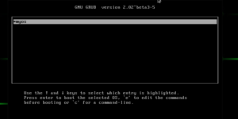
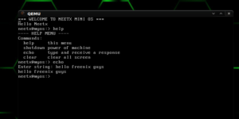

OSDEVTRAINING
========
Mini OS, developed just for training. A BIG thanks to wiki.osdev.org for initial code and good theory stuff! <br/>

### CONTACTS:
[Neetx](mailto:neetx@protonmail.com)

---

This little OS isn't optimized, and it hasn't all basically features. I just played with this topic and shared it.

#### 1-Requirements
I worked on Debian 9 with:
```
gcc (Debian 6.3.0-18) 6.3.0 20170516
g++ (Debian 6.3.0-18) 6.3.0 20170516
GNU Make 4.1
bison (GNU Bison) 3.0.4
flex 2.6.1
libgmp3-dev/stable,stable,now 2:6.1.2+dfsg-1 amd64
libmpfr-dev/stable,stable 3.1.5-1 amd64
libisl-dev/stable,stable 0.18-1 amd64
libcloog-isl-dev/stable,stable 0.18.4-1+b1 amd64
libmpc-dev/stable,stable 1.0.3-1+b2 amd64
texinfo/stable,stable,now 6.3.0.dfsg.1-1+b2 amd64
binutils/stable,stable,now 2.28-5 amd64 [installato]
binutils-arm-linux-gnueabi/stable,stable,now 2.28-5 amd64
libgcj17/stable,stable,now 6.3.0-18 amd64 
xorriso 1.4.6
```

To check your program version use: program –version
I installed them with apt packet manager.

#### 2-Cross-Compiler
We need these programs to build our cross compiler for i686-elf because we must program on our host machine, but we need different binary. In my case I work from x86-64 arch so elf-64 is not good for i686 arch: i686-elf is the answer.
Let’s setup our environment (folders creation + env setup):
```
cd $HOME
mkdir OsDev; cd OsDev
mkdir opt; cd opt
mkdir cross; cd cross
mkdir bin
export PREFIX="$HOME/OsDev/opt/cross"
export TARGET=i686-elf
export PATH="$PREFIX/bin:$PATH"
```

Now we have our workspace into path for this terminal session (You don’t need to specify the path of each binary for this terminal session).

Download and install binutils in our workspace for i686-elf:
```
cd $HOME/OsDev/
mkdir src
cd src
mkdir build-binutils
cd build-binutils
git clone git://sourceware.org/git/binutils-gdb.git
cd binutils-gdb
./configure --target=$TARGET --prefix="$PREFIX" --with-sysroot --disable-nls --disable-werror
make
make install
```

The results will be in $HOME/OsDev/opt/cross/bin folder.

Download and install GCC in our workspace for i686-elf:
```
cd $HOME/OsDev/src
mkdir build-gcc
cd build-gcc
git clone https://github.com/gcc-mirror/gcc
cd gcc
./configure --target=$TARGET --prefix="$PREFIX" --disable-nls --enable-languages=c,c++ --without-headers
make all-gcc
make install gcc
```
The results will be in $HOME/OsDev/opt/cross/bin folder.
We have our cross-compiler!

#### 3-Cloning repository
Use my repo. Please think about my code, I appreciate that you read and test the article, but I will be happy if you try to understand/improve my code or write your own, wiki.osdev.org will give you A LOT of help!
Clone my repo:
```
cd $HOME/src/
mkdir minimal-kernel
cd minimal-kernel
git clone https://github.com/Neetx/osdevTraining/
```
There are 3 important files:
1- boot.s
2- kernel.c
3- linker.ld

#### 4-Bootstrap
To boot into any OS we need bootloader (we will setup and use GRUB next).
How bootloader starts the kernel? Thanks to a “Multiboot Standard” we only need to put some values in some global variables: multiboot header, the bootloader will search for them and then it will know how to boot our OS.
We must write bootstrap in assembly code because there is no stack yet and asm can work without (we use asm to setup stack too).

boot.s is our bootstrap, let’s assemble it with our new binaries:
```
i686-elf-as boot.s -o boot.o
```

#### 5-Compile the kernel
Now we have the setup to use higher level language: C (you can use some other).
Normal C programming is in user space, also called Hosted Environment: you have a lot of useful library!!
But we must use Freestanding environment so there isn’t standard libraries:
We are alone with our code, our logic and our creativity. Keep it in mind!
Initial code has only simple, but good, vga text mode and an hello world.
I implemented some nice and small things, for example input from keyboard, but I will explain it next.

Now compile the kernel!

```
i686-elf-gcc -c kernel.c -o kernel.o -std=gnu99 -ffreestanding -O2 -Wall -Wextra
```

#### 6-Linker
We can now link the boot.o and kernel.o files to create our final kernel.
There aren’t script for linking in kernel-development so we need our linker.ld.
Let’s link:
```
i686-elf-gcc -T linker.ld -o myos.bin -ffreestanding -O2 -nostdlib boot.o kernel.o 
```

To verify if myos.bin has multiboot type:
```
grub-file --is-x86-multiboot myos.bin
```
..if it’s quite, it’s OK.

Now we create the bootable image with grub.cfg and myos.bin:
(grub.cfg is a simple file with the entry point OS)

```
cd $HOME/src/minimal-kernel/osdevTraining/
mkdir -p isodir/boot/grub
cp myos.bin isodir/boot/myos.bin
cp grub.cfg isodir/boot/grub/grub.cfg
grub-mkrescue -o myos.iso isodir
```
Now we have our myos.iso ! For testing: 
```
qemu-system-i386 -cdrom myos.iso
```
In my code there is a loop for command execution.
You can use these commands:
1- help
2- echo
3- clear
4- shutdown

I explain my code by comments in code, there are the VERY GOOD comments by wiki.osdev.org that I left in the code (without this site I can’t do this, another THANKS)
As you can see I wrote some basic functions because in freestanding environment there is nothing!

Testing on real hardware:
```
sudo dd if=myos.iso of=/dev/sdx && sync
```

---

### Screenshot


